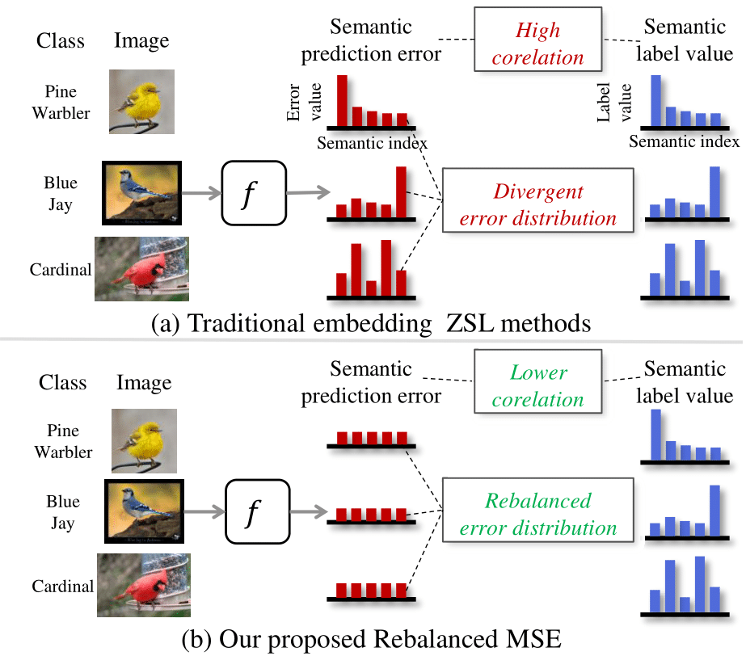

# PyTorch implementation of "Rebalanced Zero-shot Learning" [TIP 2023 Paper] #

**Paper:** https://arxiv.org/abs/2210.07031

<div align="center">
    
</div>

Zero-shot learning (ZSL) aims to identify unseen classes with zero samples during training.
Broadly speaking, present ZSL methods usually adopt class-level semantic labels and compare them with instance-level semantic predictions to infer unseen classes.
However, we find that such existing models mostly produce imbalanced semantic predictions, i.e. these models could perform precisely for some semantics, but  may not for others. To address the drawback, we aim to introduce an imbalanced learning framework into ZSL. However, we find that imbalanced ZSL has two unique challenges: (1) Its imbalanced predictions are highly correlated with the value of semantic labels rather than the number of samples as typically considered in the traditional imbalanced learning; (2) Different semantics follow quite different error distributions between classes. To mitigate these issues, we first formalize ZSL as an imbalanced regression problem  which offers empirical evidences to interpret how semantic labels lead to imbalanced semantic predictions. We then propose a re-weighted loss termed Re-balanced Mean-Squared Error (ReMSE), which tracks the mean and variance of error distributions, thus ensuring rebalanced learning across classes. As a major contribution, we conduct a series of analyses showing that ReMSE is theoretically well established. Extensive experiments demonstrate that the proposed method effectively alleviates the imbalance in semantic prediction and outperforms many state-of-the-art ZSL methods.

## Prerequisites
+ Python 3.8
+ Pytorch 1.12.1
+ torchvision 0.13.1
+ scikit-learn 1.3.0
+ scipy=1.10.0
+ numpy 1.24.3
+ numpy-base 1.24.3
+ pillow 9.4.0

## Data preparation

We trained the model on three popular ZSL benchmarks: [CUB](http://www.vision.caltech.edu/visipedia/CUB-200-2011.html), [SUN](http://cs.brown.edu/~gmpatter/sunattributes.html) and [AWA2](http://cvml.ist.ac.at/AwA2/) following the data split of [xlsa17](http://datasets.d2.mpi-inf.mpg.de/xian/xlsa17.zip).

### Download Dataset 

Firstly, download these datasets as well as the xlsa17. Then decompress and organize them as follows: 
```
.
├── Dataset
│   ├── CUB/CUB_200_2011/...
│   ├── SUN/images/...
│   ├── AWA2/Animals_with_Attributes2/...
│   └── xlsa17/data/...
│   ├── Attribute/w2v/
└── ···
```

### Download Semantic-level Word2Vec

Secondly, download extracted semantic-level word2Vec (https://drive.google.com/file/d/1Pt21tEDjKUTS3QWx_t7zJZjrcM52YCIU/view?usp=drive_link) and unzip it to the dir `/Dataset/Attribute/w2v/`.

## Training

To train and evaluate ZSL and GZSL models, please run the file `./tools/train.py` with the scripts in `./config/`, e.g.:
```
CUDA_VISIBLE_DEVICES=0 python ./tools/train.py --config-file config/AttentionNet/cub_16w_2s_AttentionNet.yaml
```

## Results
Following table shows the results of our released models using various evaluation protocols on three datasets, both in the ZSL and GZSL settings:

| Dataset | T1 (ZSL) | U (GZSL) | S (GZSL) | H (GZSL) |
| :-----: | :-----: | :-----: | :-----: | :-----: |
| CUB | 80.9 | 72.8 | 74.8 | 73.8 |
| AWA2 | 70.9 | 63.8 | 85.6 | 73.1 |
| SUN | 63.2 | 47.4 | 34.8 | 40.1 |

## Usage of ReMSE
Of course, our ReMSE could be easily applied to other regression or multi-modal tasks.
We provide examples of how to apply ReMSE on other customized datasets and/or models:
```python
from REZSL.modeling import ReZSL, weighted_RegressLoss

# customized training dataset
tr_dataloader = ...
# customized model and optimizer
model, optimizer = ..., ... 
# RegNorm: bool type, l2-normalized reg_label or not, RegType: 'MSE' or "BMC"
Reg_loss = weighted_RegressLoss(RegNorm, RegType="MSE", device="cuda")

rezsl = ReZSL(p=cfg.MODEL.REZSL.P, p2=cfg.MODEL.REZSL.P2, att_dim=reg_label_dim, train_class_num=scls_num,
                  test_class_num=cls_num, RegNorm=RegNorm, RegType=RegType, device=device)

for iteration, (batch_img, batch_reg_label, batch_cls_label) in enumerate(tr_dataloader):
    reg_pred = model(x=batch_img)
    n = reg_pred.shape[0]
    reg_label_dim = batch_reg_label.shape[1]
    rezsl.updateWeightsMatrix_crossBatch(reg_pred.detach(), batch_reg_label.detach(), batch_cls_label.detach()) # updateWeightsMatrix_crossBatch or updateWeightsMatrix_inBatch
    weights = rezsl.getWeights(n, reg_label_dim, batch_cls_label.detach()).detach()  # weights matrix does not need gradients

    loss = Reg_loss(reg_pred, batch_reg_label, weights)

    optimizer.zero_grad()
    loss.backward()
    optimizer.step()
```

## License

This code is released under the MIT License. See [LICENSE](LICENSE) for additional details.

## Bibtex ##
If this work is helpful for you, please cite our paper:

```
@inproceedings{
ye2023rebalanced,
title={Rebalanced Zero-shot Learning},
author={Zihan Ye and Guanyu Yang and Xiaobo Jin and Youfa Liu and Kaizhu Huang},
journal={IEEE transactions on image processing},
doi={10.1109/TIP.2023.3295738}},
publisher={IEEE},
year={2023}
}
```

## References
Parts of our codes based on:
* [osierboy/GEM-ZSL](https://github.com/osierboy/GEM-ZSL)
* [YyzHarry/imbalanced-regression](https://github.com/YyzHarry/imbalanced-regression)
